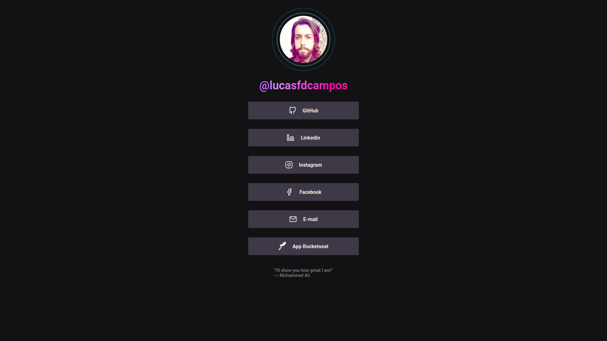

<h1 align="center">
  Link-tree
   
  
</h1>

<h3 align="center">
  Simple page of useful links.
</h3>

  
  
  
  
  

  <a href="#-about">About</a>&nbsp;&nbsp;&nbsp;|&nbsp;&nbsp;&nbsp;
  <a href="#-layout">Layout</a>

## 🔗 About

Simple site to group all my profiles on social networks in one place. Check the [link](https://lucasfdcampos.github.io/link-tree/).

## 🔖 Layout

In the links below you will find all of my profiles.

  

---

&nbsp

